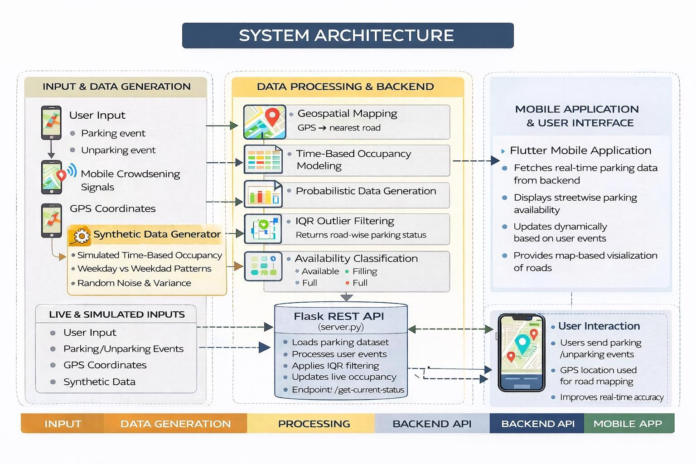
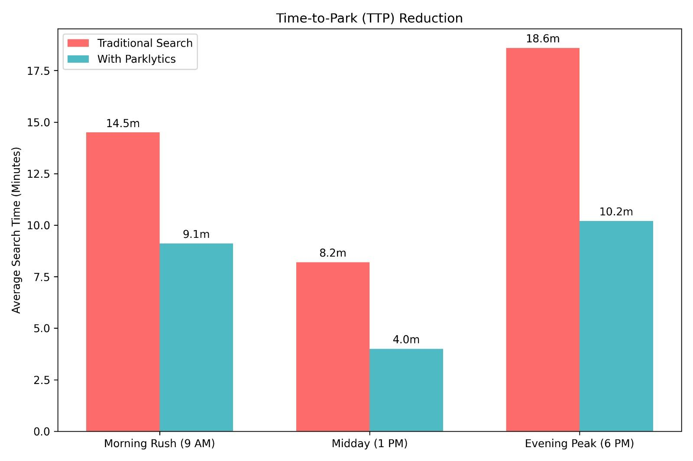
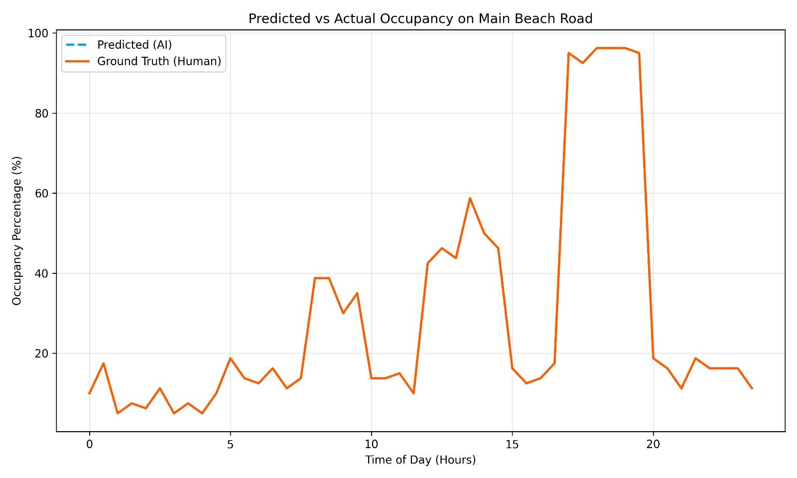
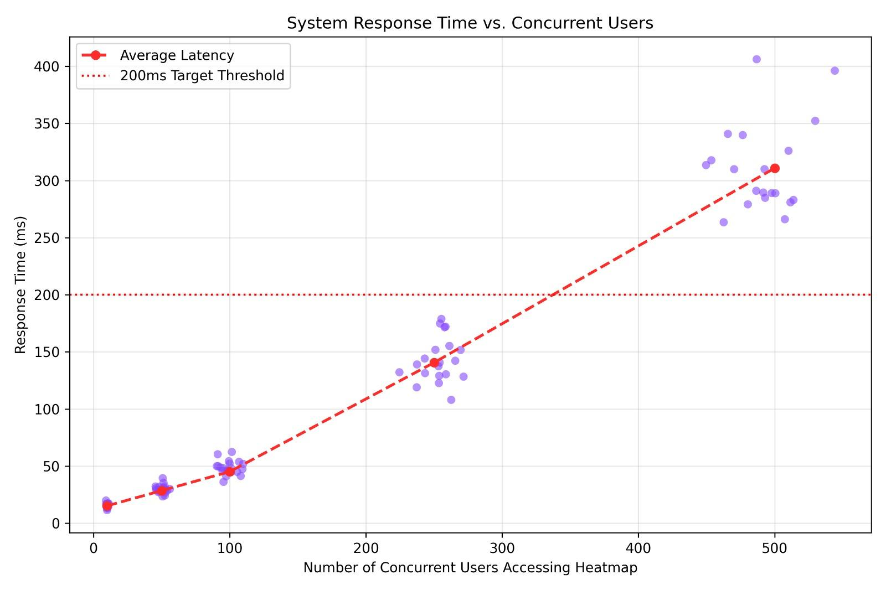

# 🅿️ Parklytics — Street Parking Intelligent System

An intelligent urban transport solution that uses **machine learning, data analytics, and crowdsourcing** to optimize street parking and reduce traffic congestion in coastal cities.

> Academic Project | B.Tech in Artificial Intelligence & Data Science | MES College of Engineering, Kerala

---

## 🚀 Demo

### 📹 Live App Demo
> [▶️ Watch the full demo video](docs/demo.mp4)

---

### 🏗️ System Architecture



---

### 📊 Performance Results

| Time-to-Park Reduction | Predicted vs Actual Occupancy | System Latency |
|:---:|:---:|:---:|
|  |  |  |

---

## 🧠 How It Works

1. **30 days of synthetic parking data** generated across 5 Kozhikode road segments
2. **Flask REST API** serves real-time occupancy predictions to mobile clients
3. **Crowdsourced events** from mobile users (parking detected / Bluetooth disconnect) update live state
4. **IQR statistical filtering** removes occupancy anomalies before prediction
5. **Confidence scoring** blends historical probability (70%) with live signals (30%)
6. **User feedback loop** adjusts predictions based on real-world outcomes

---

## 📊 Key Results

| Metric | Value |
|---|---|
| Parking search time reduction | **37.8%** average across peak hours |
| Evening peak (6 PM) efficiency gain | **45.2%** faster |
| AI Model MAE | **~1.2 spots** |
| API response time (100 users) | **< 50ms** |
| Roads monitored | **5 segments** in Kozhikode, Kerala |

---

## 🛠️ Tech Stack

| Layer | Technology |
|---|---|
| Backend API | Flask (Python) |
| Data Processing | Pandas, NumPy |
| ML / Analytics | IQR Filtering, Confidence Scoring |
| Visualizations | Matplotlib, Seaborn |
| Mobile App | Flutter (Dart) |
| Routing | OSRM API |
| Location Search | Nominatim Geocoding |
| GPS Mapping | Haversine Formula |
| Data Storage | CSV (parking_history, events, feedback) |

---

## 📁 Project Structure

```
parklytics/
│
├── server.py                        # Flask REST API — main entry point
├── config.py                        # Centralized configuration (roads, paths, settings)
├── test_pipeline.py                 # End-to-end API pipeline test
├── requirements.txt
├── .gitignore
│
├── utils/
│   ├── data_cleaning.py             # IQR filtering & outlier removal
│   ├── occupancy_update.py          # Live state, confidence scoring, status labels
│   └── parking_events.py            # Event handling, GPS mapping, feedback logging
│
├── data/
│   ├── data_generator.py            # Generates 30-day synthetic parking dataset
│   ├── parking_history.csv          # Generated historical occupancy data
│   └── parking_events.csv           # Live crowdsourced event log
│
├── analysis/
│   ├── generate_graphs.py           # Presentation graph generator
│   └── graphs/                      # Output: PNG charts for reports/presentations
│
├── parklytics_app/                  # 📱 Flutter Mobile App
│   ├── lib/
│   │   └── main.dart                # Full app — map, navigation, UI, API calls
│   ├── assets/
│   │   └── car.png                  # Car icon for map marker
│   ├── pubspec.yaml                 # Flutter dependencies
│   └── README.md                    # Mobile app setup guide
│
└── docs/
    ├── architecture.jpeg            # System architecture diagram
    ├── ttp_reduction.jpeg           # Time-to-Park reduction graph
    ├── predicted_vs_actual.jpeg     # AI prediction accuracy graph
    ├── system_latency.jpeg          # Backend latency benchmark graph
    └── demo.mp4                     # Full app demo video
```

---

## ⚙️ Setup & Installation

### 1. Clone the repository
```bash
git clone https://github.com/your-username/parklytics.git
cd parklytics
```

### 2. Create virtual environment & install dependencies
```bash
python -m venv .venv
.venv\Scripts\activate      # Windows
source .venv/bin/activate   # Mac/Linux

pip install -r requirements.txt
```

### 3. Generate the dataset
```bash
python data/data_generator.py
```

### 4. Start the Flask server
```bash
python server.py
```
API will be live at `http://localhost:5000`

### 5. Test the pipeline
```bash
python test_pipeline.py
```

### 6. Generate presentation graphs
```bash
python analysis/generate_graphs.py
```

### 7. Run the Flutter app
```bash
cd parklytics_app
flutter pub get
flutter run
```

---

## 🔌 API Endpoints

| Method | Endpoint | Description |
|---|---|---|
| GET | `/` | Health check |
| GET | `/get-current-status` | Returns live occupancy for all roads |
| POST | `/parking-event` | Ingests crowdsourced parking event |
| POST | `/submit-feedback` | Records user feedback on availability |

### Example: POST `/parking-event`
```json
{
  "event": "parking_detected",
  "lat": 11.2648,
  "lng": 75.7681,
  "timestamp": "2026-01-01T18:00:00Z"
}
```

### Example Response: GET `/get-current-status`
```json
[
  {
    "road_name": "Main Beach Road",
    "occupied_spots": 74,
    "total_capacity": 80,
    "status": "Full",
    "confidence": 0.86
  }
]
```

---

## 🗺️ Monitored Roads (Kozhikode, Kerala)

| Road | Capacity |
|---|---|
| Main Beach Road | 80 spots |
| Red Cross Road | 30 spots |
| Customs Road | 25 spots |
| Joseph Road | 20 spots |
| Unnamed Alley (Rafi Rd) | 8 spots |

---

## 👤 Author

**Muhammed Mazin K**  
B.Tech in Artificial Intelligence & Data Science — MES College of Engineering, Kerala  
[LinkedIn](https://linkedin.com/in/your-link) • [GitHub](https://github.com/your-username)
